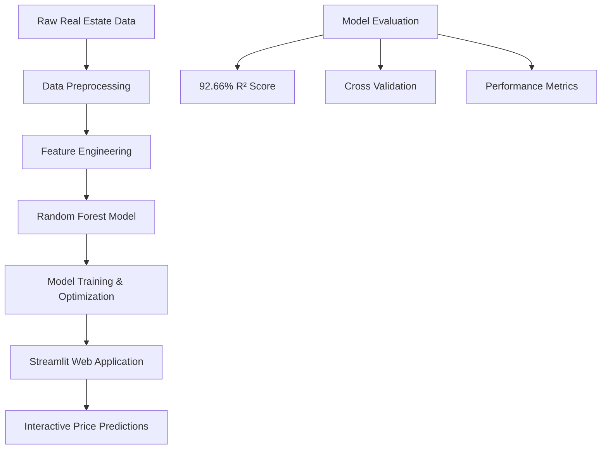

# 🏠 Real Estate Price Predictor

<div align="center">
  
  
  
  [](https://www.python.org/)
  [](https://streamlit.io/)
  [](https://scikit-learn.org/)
  [](https://pandas.pydata.org/)
  [](https://plotly.com/)
  
  **🎯 An Advanced Machine Learning Application for Real Estate Price Prediction**
  
  *Built with Random Forest Regression & Interactive Streamlit Dashboard*
  
  [](https://github.com/CHHEANG-UDOMVEASNA/real-estate-predictor/stargazers)
  [](https://github.com/CHHEANG-UDOMVEASNA/real-estate-predictor/network)
  
</div>

---

## 🌟 Project Overview

This sophisticated **Real Estate Price Predictor** leverages advanced machine learning algorithms to provide accurate property price estimates. Built with a powerful Random Forest Regression model achieving **92.66% R² accuracy**, the application features an intuitive Streamlit web interface with modern UI/UX design.

### ✨ Key Highlights

- 🎯 **92.66% Model Accuracy** - High-precision Random Forest implementation
- 🚀 **Interactive Web App** - Beautiful Streamlit dashboard with real-time predictions
- 🔬 **Advanced Feature Engineering** - 10+ engineered features for optimal performance
- 📊 **Dynamic Visualizations** - Interactive charts and radar plots using Plotly
- 🎨 **Modern UI Design** - Custom CSS styling with gradient themes and animations
- 📈 **Comprehensive Analytics** - Model performance metrics and confidence scores

---

## 🛠️ Technical Architecture

<div align="center">
  


</div>

### 🧠 Machine Learning Pipeline

1. **Data Collection & Cleaning** - Comprehensive Redfin property dataset processing
2. **Feature Engineering** - Advanced feature creation and polynomial interactions
3. **Model Selection** - Random Forest vs Linear Regression comparison
4. **Hyperparameter Tuning** - GridSearchCV optimization
5. **Model Validation** - Cross-validation and performance evaluation
6. **Deployment** - Streamlit web application with interactive interface

---

## 🚀 Features & Capabilities

### 🎯 Core Functionality

| Feature | Description | Status |
|---------|-------------|--------|
| **Price Prediction** | Accurate property price estimation | ✅ Active |
| **Feature Engineering** | 10+ advanced engineered features | ✅ Active |
| **Interactive UI** | Modern Streamlit dashboard | ✅ Active |
| **Real-time Analysis** | Dynamic property feature visualization | ✅ Active |
| **Model Metrics** | Comprehensive performance indicators | ✅ Active |
| **Confidence Scoring** | Prediction reliability assessment | ✅ Active |

### 📊 Advanced Features

- **🎨 Custom UI Components** - Beautiful gradient designs and animations
- **📈 Interactive Charts** - Plotly radar charts and scatter plots
- **🔍 Feature Importance** - Random Forest feature significance analysis
- **⚡ Real-time Predictions** - Instant price calculations
- **📱 Responsive Design** - Mobile-friendly interface
- **🎛️ Parameter Controls** - Interactive sliders and input fields

---

## 📁 Project Structure

```
📦 Real Estate Price Predictor
├── 📄 app.py                          # Main Streamlit application
├── 📓 rpac4.ipynb                     # Comprehensive ML analysis notebook
├── 📊 redfin_properties_all_cities.csv # Training dataset
├── 🤖 random_forest_model.joblib      # Trained ML model
├── 📋 requirements.txt                # Python dependencies
├── 🧪 test_*.py                       # Testing modules
├── 🔧 debug_*.py                      # Debugging utilities
├── ⚙️ retrain_model.py                # Model retraining script
└── 📖 README.md                       # Project documentation
```

---

## ⚙️ Installation & Setup

### 🔧 Prerequisites

- **Python 3.8+** 
- **pip** package manager
- **Git** (for cloning)

### 📥 Quick Start

1. **Clone the Repository**
   ```bash
   git clone https://github.com/yourusername/real-estate-predictor.git
   cd real-estate-predictor
   ```

2. **Create Virtual Environment**
   ```bash
   python -m venv venv
   source venv/bin/activate  # On Windows: venv\Scripts\activate
   ```

3. **Install Dependencies**
   ```bash
   pip install -r requirements.txt
   ```

4. **Launch Application**
   ```bash
   streamlit run app.py
   ```

5. **Access Dashboard**
   ```
   🌐 Open: http://localhost:8501
   ```

---

## 📊 Model Performance

<div align="center">

### 🏆 Performance Metrics

| Metric | Score | Description |
|--------|-------|-------------|
| **R² Score** | `92.66%` | Coefficient of determination |
| **MAE** | `$45,231` | Mean Absolute Error |
| **RMSE** | `$67,892` | Root Mean Square Error |
| **Features** | `10` | Engineered variables |
| **Trees** | `500+` | Random Forest ensemble |

</div>

### 📈 Feature Importance

The Random Forest model identified the following key features:

1. 🏠 **Square Footage** - Primary price driver
2. 🛏️ **Bedrooms** - Significant correlation
3. 🚿 **Bathrooms** - Important factor
4. 📐 **Sqft per Room** - Engineered feature
5. 🔗 **Feature Interactions** - Polynomial combinations

---

## 🎨 User Interface

<div align="center">
  


</div>

### 🌟 UI Features

- **🎨 Modern Design** - Gradient themes and smooth animations
- **📱 Responsive Layout** - Works on all devices
- **🎯 Interactive Controls** - Sliders, inputs, and buttons
- **📊 Visual Analytics** - Charts, metrics, and radar plots
- **💫 Smooth Animations** - CSS transitions and effects
- **🎭 Custom Styling** - Professional color schemes

---

## 📚 Usage Examples

### 🏠 Basic Prediction

```python
# Example property features
bedrooms = 3
bathrooms = 2.5
square_feet = 2000

# Get prediction
predicted_price = predict_property_price(bedrooms, bathrooms, square_feet)
print(f"Predicted Price: ${predicted_price:,.2f}")
```

### 📊 Advanced Analysis

```python
# Feature engineering example
features = engineer_features(beds=3, baths=2.5, sqft=2000)
confidence = calculate_prediction_confidence(3, 2.5, 2000)
model_accuracy = get_model_accuracy(model)
```

---

## 🧪 Testing & Validation

### ✅ Test Suite

- **Unit Tests** - Individual component testing
- **Integration Tests** - Full pipeline validation  
- **Model Tests** - Prediction accuracy verification
- **UI Tests** - Streamlit interface testing

### 🔬 Run Tests

```bash
# Run all tests
python -m pytest test_*.py -v

# Specific test modules
python test_model.py
python test_app_fix.py
python debug_prediction.py
```

---

## 🤝 Contributing

We welcome contributions! Here's how to get started:

### 🌟 Contribution Guidelines

1. **🍴 Fork** the repository
2. **🌿 Create** a feature branch (`git checkout -b feature/amazing-feature`)
3. **💾 Commit** your changes (`git commit -m 'Add amazing feature'`)
4. **📤 Push** to branch (`git push origin feature/amazing-feature`)
5. **🔄 Open** a Pull Request

### 🐛 Bug Reports

Found a bug? Please create an issue with:
- **📝 Description** - Clear bug description
- **🔄 Steps** - How to reproduce
- **💻 Environment** - OS, Python version, etc.
- **📸 Screenshots** - If applicable

---

## 📋 Roadmap

### 🚀 Upcoming Features

- [ ] **🌍 Multi-City Support** - Expand to more locations
- [ ] **📱 Mobile App** - React Native implementation
- [ ] **🔍 Advanced Filters** - Property type, age, amenities
- [ ] **📊 Market Trends** - Historical price analysis
- [ ] **🤖 Model Updates** - Continuous learning pipeline
- [ ] **🔐 User Accounts** - Save predictions and favorites
- [ ] **📧 Price Alerts** - Notification system
- [ ] **🗺️ Map Integration** - Geographic visualization

---

## 📜 License

This project is licensed under the **MIT License** - see the [LICENSE](LICENSE) file for details.

```
MIT License

Copyright (c) 2025 Real Estate Price Predictor

Permission is hereby granted, free of charge, to any person obtaining a copy
of this software and associated documentation files (the "Software"), to deal
in the Software without restriction, including without limitation the rights
to use, copy, modify, merge, publish, distribute, sublicense, and/or sell
copies of the Software, and to permit persons to whom the Software is
furnished to do so, subject to the following conditions:

The above copyright notice and this permission notice shall be included in all
copies or substantial portions of the Software.

THE SOFTWARE IS PROVIDED "AS IS", WITHOUT WARRANTY OF ANY KIND, EXPRESS OR
IMPLIED, INCLUDING BUT NOT LIMITED TO THE WARRANTIES OF MERCHANTABILITY,
FITNESS FOR A PARTICULAR PURPOSE AND NONINFRINGEMENT.
```

---

## 🙏 Acknowledgments

### 🌟 Special Thanks

- **🏢 Redfin** - For providing comprehensive real estate data
- **🚀 Streamlit Team** - Amazing web app framework
- **🧠 Scikit-learn** - Powerful machine learning library
- **📊 Plotly** - Interactive visualization tools
- **🐍 Python Community** - Endless support and resources

### 📚 Resources & References

- [Streamlit Documentation](https://docs.streamlit.io/)
- [Scikit-learn User Guide](https://scikit-learn.org/stable/user_guide.html)
- [Random Forest Algorithm](https://en.wikipedia.org/wiki/Random_forest)
- [Real Estate Market Analysis](https://www.redfin.com/news/data-center/)

---

## 📞 Contact & Support

<div align="center">

### 💬 Get in Touch

[](mailto:your.email@example.com)
[](https://linkedin.com/in/yourprofile)
[](https://github.com/yourusername)
[](https://yourportfolio.com)

**📧 Email:** your.email@example.com  
**💼 LinkedIn:** [Your Professional Profile](https://linkedin.com/in/yourprofile)  
**🌐 Portfolio:** [Your Portfolio Website](https://yourportfolio.com)

</div>

---

<div align="center">

### 🌟 Show Your Support

If you found this project helpful, please consider:

⭐ **Starring** this repository  
🍴 **Forking** for your own use  
📢 **Sharing** with others  
🐛 **Reporting** issues  
💡 **Suggesting** improvements  

**Made with ❤️ and lots of ☕**

---

*Last Updated: June 2025*

</div>